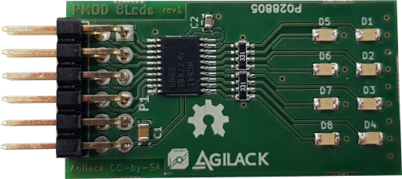
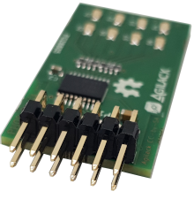
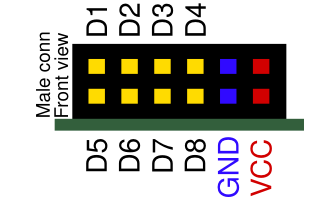
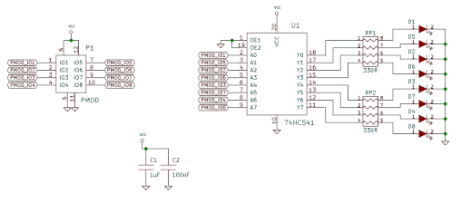
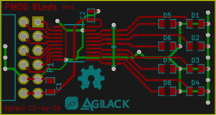
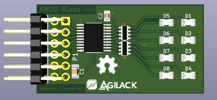

PMOD 8 Leds
===========

This project is a PMOD prototyping board with 8 LEDs.

 | 
------------------- | -------------------------------

The board connector use a PMOD type 1A pinout. Each available GPIO is
connected to one LED with a component id that reflect signel id (LED D1 is
mapped to signal GPIO1, D2 for GPIO2 ...)
To avoid driving too much current from host ios, a buffer is placed between
connector and LEDs. This buffer add a small latency (~5ns) and limit the
switching frequency to fwe dozen MHz but this seem to be acceptable for
LEDs ;)

Designed with Kicad
-------------------
This board has been designed using Kicad 5.0.2
For a better compatibility and a simplified distribution of this project,
all schematics components are available into a custom project library. It's
the same for board footprints that have been saved into a cutom library. For
3D models, default kicad parts are used (and some display errors can occurs)

 |  | 
------------------------- | ------------------------- | ---------------------------------

License
-------

This project is licensed under a [Creative Commons Attribution-ShareAlike 4.0 International License](http://creativecommons.org/licenses/by-sa/4.0/).

